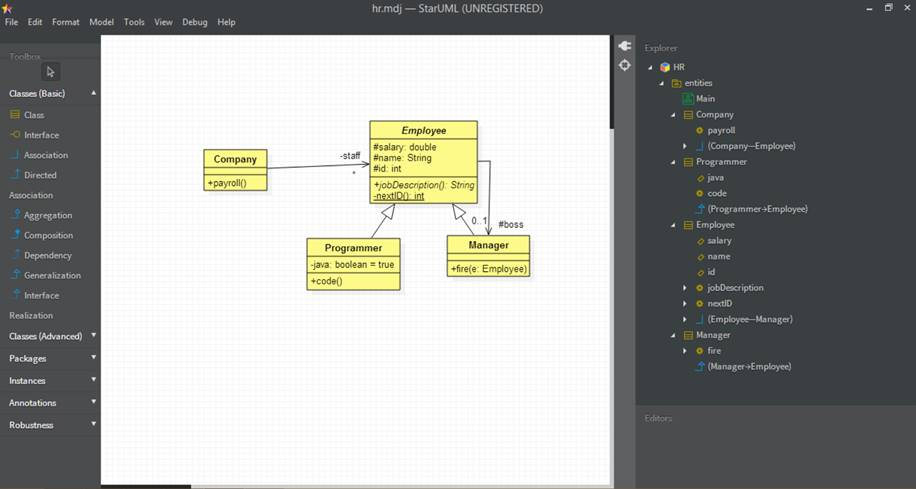

## Design Analyzer
This application uses NodeJS v7.7.4

### Description:
Design Analyzer (DA) is a tool for analyzing models created using StarUML 2.0.

DA reads a .mdj file created by StarUML, then computes and prints the *stability*, *responsibility*, and *deviance* of every class in the model. 

>Note: DA assumes the model consists of a single class diagram together with the accompanying model elements (classes, associations, generalizations, packages, etc.).

The output will be in table-format in which columns represent metrics and rows classes.

### An Example:
Lets assume we use StarUML to create a project called HR:



StarUML saves the project in a file called hr.mdj. This file contains a single JSON object that reflects the tree-like structure depicted in the explorer panel to the right of the diagram. You can get a collapsible/expandable look at this huge object by pasting the contents of the file into a JSON formatter/validator.

Here's the basic structure of the JSON object contained in hr.mdj:

```
{

   "_type": "Project",
   "_id": "AAAAAAFF+h6SjaM2Hec=",
   "name": "HR",
   "ownedElements": [
      {
         "_type": "UMLModel",
         "_id": "AAAAAAFF+qBWK6M3Z8Y=",
         "_parent": {
            "$ref": "AAAAAAFF+h6SjaM2Hec="
         },
         "name": "entities",
         "ownedElements": [...]
      }
   ]
}
```

We can see that the top-level JSON object, which represents the entire project, has four fields: _type, _id, name ("HR"), and an array of owned elements.

The array contains a single JSON object representing the project's only model: entities. It too has _type, _id, name, and ownedElements fields as well as a _parent field containing a reference to the _id field of its owner, the HR project.

The entities model owns five elements corresponding to main (the class diagram) and the four classes: Company, Employee, Programmer, and Manager.

The class diagram object is long and complicated. For each box, arrow, and label in the diagram it describes in detail things like position, size, color, font, etc. Fortunately, we can skip this part. We're concerned with logic not geometry.

Next come the four class objects. Here's the JSON object representing the Employee class. Notice that it has arrays holding its owned elements (only the association to the Manager class), its attributes (salary, name, and id), and its operations (job and nextID).

```
{
   "_type": "UMLClass",
   "_id": "AAAAAAFLhnPAnH64Mg8=",
   "_parent": { "$ref": "AAAAAAFF+qBWK6M3Z8Y=" },
   "name": "Employee",
   "ownedElements": [...],
   "visibility": "public",
   "attributes": [...],
   "operations": [...],
   "isAbstract": true,
   "isFinalSpecialization": false,
   "isLeaf": false,
   "isActive": false
}
```

Our Employer-Manager association doesn't have a name (although it could). Here's what it looks like:

```
{
   "_type": "UMLAssociation",
   "_id": "AAAAAAFLhn7ApIEXikk=",
   "_parent": { "$ref": "AAAAAAFLhnPAnH64Mg8=" },
   "end1": {...},
   "end2": {...},
   "visibility": "public",
   "isDerived": false
}
```

Each association has two endpoints. End1 is the side connected to the Employee class, end2 connects to the Manager class. The reference number is the id of the associated class: Here's the end2 object:

```
{
   "_type": "UMLAssociationEnd",
   "_id": "AAAAAAFLhn7ApIEZWH8=",
   "_parent": { "$ref": "AAAAAAFLhn7ApIEXikk=" },
   "name": "boss",
   "reference": { "$ref": "AAAAAAFLhnRuDX7f/d0=" },
   "visibility": "protected",
   "navigable": true,
   "aggregation": "none",
   "multiplicity": "0..1",
   "isReadOnly": false,
   "isOrdered": false,
   "isUnique": false,
   "isDerived": false,
   "isID": false
}
```

Here's the salary attribute:

```
{
   "_type": "UMLAttribute",
   "_id": "AAAAAAFLhnUQgX8HarU=",
   "_parent": { "$ref": "AAAAAAFLhnPAnH64Mg8=" },
   "name": "salary",
   "visibility": "protected",
   "isStatic": false,
   "isLeaf": false,
   "type": "double",
   "isReadOnly": false,
   "isOrdered": false,
   "isUnique": false,
   "isDerived": false,
   "aggregation": "none",
   "isID": false
}
```

Here's the nextID operation, it contains an array of parameters:

```
{
   "_type": "UMLOperation",
   "_id": "AAAAAAFLhncCz38rbt0=",
   "_parent": { "$ref": "AAAAAAFLhnPAnH64Mg8=" },
   "name": "nextID",
   "visibility": "private",
   "isStatic": true,
   "isLeaf": false,
   "parameters": [...]
   "concurrency": "sequential",
   "isQuery": false,
   "isAbstract": false
}
```

The return type of an operation is considered to be a parameter with direction = "return":

```
{
   "_type": "UMLParameter",
   "_id": "AAAAAAFLhnclH38yalQ=",
   "_parent": { "$ref": "AAAAAAFLhncCz38rbt0=" },
   "visibility": "public",
   "isStatic": false,
   "isLeaf": false,
   "type": "int",
   "isReadOnly": false,
   "isOrdered": false,
   "isUnique": false,
   "direction": "return"
}
```

### Sample run:
Here's a sample run:

```
c:\demos>node ./main
Enter file name: hr.mdj
project classes:
  Company
    operations:
      payroll
  Programmer
    operations:
      code
  Employee
    operations:
      jobDescription
      nextID
  Manager
    operations:
      fire
```


### Sample output for the above hr class diagram(I made a new .mdj file having the class diagram)
```
sidmishraw@Sidharths-MBP ~/D/w/design_analyzer_npm> node main.js
:::Design Analyzer:::
Enter file name:design_analyzer.mdj
Design metrics for design_analyzer.mdj:
{
    "Employee": {
        "stability": 0.75,
        "responsibility": 0.75,
        "deviance": 0
    },
    "Company": {
        "stability": 0.75,
        "responsibility": 0,
        "deviance": 0.75
    },
    "Programmer": {
        "stability": 0.75,
        "responsibility": 0,
        "deviance": 0.75
    },
    "Manager": {
        "stability": 0.75,
        "responsibility": 0.25,
        "deviance": 0.5
    }
}
```

And the tabular output looks like:

```
class       responsibility  stability  deviance
----------  --------------  ---------  --------
Employee    0.75            0.75       0       
Company     0               0.75       0.75    
Programmer  0               0.75       0.75    
Manager     0.25            0.75       0.5     
```


